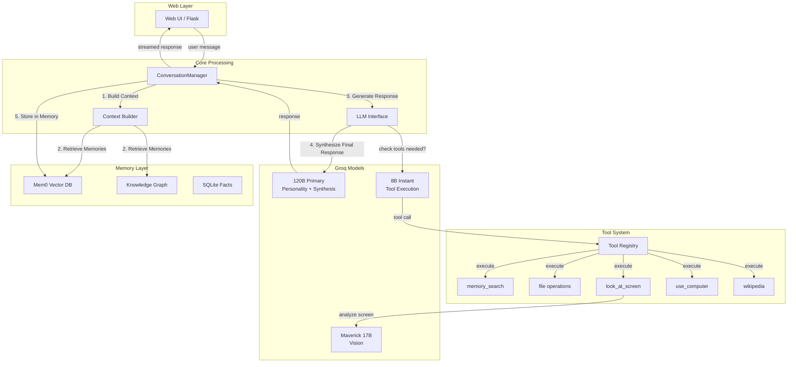
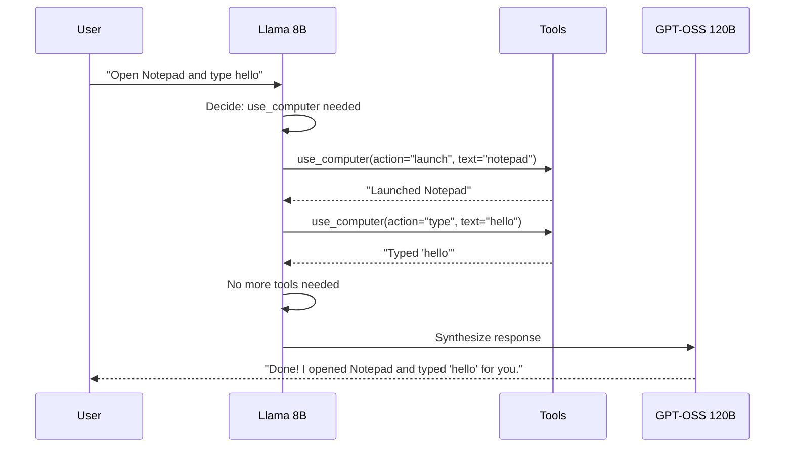

# Companion AI V4 - Architecture Overview

## High-Level Flow



---

## Request Flow (Step by Step)

### 1. User Sends Message
```
Web UI (/api/chat) → web_companion.py → ConversationSession.process_message()
```

### 2. Context Building
```python
# context_builder.py
1. Load static system prompt (YAML persona)
2. Query Mem0 for relevant memories (auto-retrieved)
3. Query Knowledge Graph for entity relationships
4. Append last 3 conversation turns
5. Build final system_prompt
```

### 3. Tool Decision (8B Model)
```python
# llm_interface.py → generate_model_response_with_tools()
1. Send minimal prompt + tool schemas to 8B
2. Model decides: use tools or respond directly
3. If tools needed → execute in loop (max 12 iterations)
4. Tools: memory_search, wikipedia, file_read, use_computer, etc.
```

### 4. Response Synthesis (120B Model)
```python
# After tools complete:
1. Collect all tool results
2. Send to 120B with user's original question
3. 120B synthesizes natural response with personality
4. Stream tokens back to UI
```

### 5. Memory Storage
```python
# Post-response (async):
1. Analyze importance (0-1 score)
2. If important: extract facts → Mem0
3. Update Knowledge Graph with entities
```

---

## Models

| Model | Role | Context | Speed | When Used |
|-------|------|---------|-------|-----------|
| **GPT-OSS 120B** | Primary personality, synthesis | 128k | ~50 tps | Final responses |
| **Llama 3.1 8B** | Tool decisions, execution | 128k | ~560 tps | Every request (cheap) |
| **Maverick 17B** | Vision analysis | 128k | ~100 tps | `look_at_screen` tool |
| ~~Compound~~ | ~~Web search~~ | - | - | Disabled |

---

## Tools Available

### Memory Tools
| Tool | Schema | Purpose |
|------|--------|---------|
| `memory_search` | `query: str` | Search Mem0 vector DB |
| `memory_insight` | `query: str, mode: str` | Search Knowledge Graph |

### File Tools
| Tool | Schema | Purpose |
|------|--------|---------|
| `read_pdf` | `file_path, page_number?` | Extract text from PDF |
| `read_image` | `file_path` | OCR on images |
| `read_docx` | `file_path` | Read Word docs |
| `list_files` | `directory, file_type?` | List directory |
| `find_file` | `filename, file_type?` | Search for files |

### Vision Tools
| Tool | Schema | Purpose |
|------|--------|---------|
| `look_at_screen` | `prompt: str` | Analyze current screen |

### Computer Control
| Tool | Schema | Purpose |
|------|--------|---------|
| `use_computer` | `action, text?` | Control mouse/keyboard |

Actions: `click`, `type`, `scroll`, `press`, `launch`, `move`, `screenshot`

### Knowledge Tools
| Tool | Schema | Purpose |
|------|--------|---------|
| `wikipedia` | `query: str` | Look up Wikipedia |
| `consult_compound` | `query: str` | Web search (if enabled) |
| `get_time` | - | Current time |

---

## Memory Systems

### Mem0 (Primary)
- **Type**: Vector database (Qdrant)
- **Storage**: `data/mem0_qdrant/`
- **Auto-retrieval**: Top 10 relevant memories per request
- **Categories**: facts, preferences, experiences

### Knowledge Graph
- **Type**: NetworkX graph + embeddings
- **Storage**: `data/knowledge_graph.pkl`
- **Search modes**: GRAPH_COMPLETION, KEYWORD, RELATIONSHIPS, TEMPORAL
- **Entities**: People, places, concepts with relationships

### SQLite (Legacy)
- **Storage**: `data/companion_ai.db`
- **Tables**: profile_facts, summaries, insights
- **Status**: Still active, being phased out

---

## Key Files

| File | Purpose |
|------|---------|
| `web_companion.py` | Flask server, API endpoints |
| `conversation_manager.py` | Session handling, memory integration |
| `llm_interface.py` | Model calls, tool execution loop |
| `tools.py` | Tool definitions and schemas |
| `context_builder.py` | Prompt construction |
| `vision_manager.py` | Screen capture, Maverick API |
| `computer_agent.py` | PyAutoGUI control |
| `memory_v2.py` | Mem0 wrapper |
| `knowledge_graph.py` | Graph operations |

---

## Tool Execution Flow


This is the actual architechture, familiarise yourself with it. You should be able to see it in the code now too